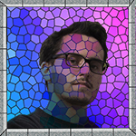
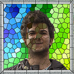

# The 42nd Sagrada

> As a skilled artisan, you will use tools-of-the-trade and careful planning to construct a stained glass window masterpiece in the Sagrada Familia.

## The project

With *The 42nd Sagrada* we want to bring to the multimedia world the tabletop game *Sagrada* by Ben Harkins. This task has been assigned as a Software Engineering Project by prof. Luca Mottola on the 3rd year of Computer Science Engineering at Politecnico di Milano.

As you all know, 42 is the answer to life, the universe and everything: we were so surprised and humbly amazed when we discovered that our team number was 42, that we decided that such an important burden deserved all the world attention. Our project's name then became **The 42nd Sagrada**.

## The authors

| Picture | Name | Personal Code |
|:---:|:---:|:---:|
|  | Archetti Alberto | 10534908 |
|  | Boffi Paolo | 10493663 |
|  | Carloni Filippo | 10541084 |
